# Technology overview

## Automated Machine Learning with Azure Machine Learning
Automated machine learning picks an algorithm and hyperparameters for you and generates a model ready for deployment. There are several options that you can use to configure automated machine learning experiments.

Configuration options available in automated machine learning:

- Select your experiment type: Classification, Regression or Time Series Forecasting
- Data source, formats, and fetch data
- Choose your compute target: local or remote
- Automated machine learning experiment settings
- Run an automated machine learning experiment
- Explore model metrics
- Register and deploy model

You can create and run automated machine learning experiments in code using the [Azure ML Python SDK](https://docs.microsoft.com/en-us/azure/machine-learning/service/how-to-configure-auto-train) or if you prefer a no code experience, you can also Create your automated machine learning experiments in the [Azure portal](https://docs.microsoft.com/en-us/azure/machine-learning/service/how-to-create-portal-experiments).

# Quickstart Overview

In this quickstart, you learn how to create, run, and explore automated machine learning experiments in the [Azure portal](https://docs.microsoft.com/en-us/azure/machine-learning/service/how-to-create-portal-experiments) without a single line of code. Next, from within the Azure portal, you will register the best trained model, create the deployment image, and deploy a scoring web service on Azure Container Instance to make predictions using the registered model. 

As part of this quickstart, we will be building a regression model to predict Taxi Fares in New York City. We will use a preprocessed labeled training data with features such as number of passengers, trip distance, datetime, holiday information and weather information.

# Exercise 1: Setting up your environment 

If a lab environment has not be provided for you, this lab provides the instructions to get started in your own Azure Subscription.

The labs have the following requirements:
- Azure subscription. You will need a valid and active Azure account to complete this Azure lab. If you do not have one, you can sign up for a [free trial](https://azure.microsoft.com/en-us/free/).

## Azure Quotas Required
The quickstarts depend on the capability to utilize a certain quantity of Azure resources, for which your Azure subscription will need to have sufficient quota available. 

The following are the specific quotas required, if your subscription does not meet the quota requirements in the region in which you will perform the quickstarts, you will need to request a quota increase thru Azure support:

Compute-VM
- Quota: Standard Dv2 Family vCPUs
- Provider: Microsoft.Compute
- SKU family: Dv2 Series
- Required Limit: 4

Compute-VM
- Quota: Total Regional vCPUs
- Provider: Microsoft.Compute
- SKU family: Dv2 Series
- Required Limit: 4

# Prerequisites

- If an environment is provided to you. Use the workspace named: `quick-starts-ws-XXXXX`, where `XXXXX` is your unique identifier.

- If you are using your own Azure subscription. Create an Azure Machine Learning service workspace named: `quick-starts-ws`. See [Create an Azure Machine Learning Service Workspace](https://docs.microsoft.com/en-us/azure/machine-learning/service/setup-create-workspace) for details on how to create the workspace.

- Download the training data file [nyc-taxi-sample-data.csv](https://quickstartsws9073123377.blob.core.windows.net/azureml-blobstore-0d1c4218-a5f9-418b-bf55-902b65277b85/quickstarts/nyc-taxi-data/nyc-taxi-sample-data.csv) on your local disk.

# Exercise 2: Setup New Automated Machine Learning Experiment

## Task 1: Create New Automated Machine Learning Experiment

1. In Azure Portal, open the machine learning workspace: `quick-starts-ws-XXXXX` or `quick-starts-ws`
2. Select `Automated machine learning` in the left navigation bar
3. Select **Create Experiment** from the content section
4. This will open a `Create a new automated machine learning experiment` page

   

5. Provide an experiment name: `auto-ml-exp`
6. Select **Create a new compute**

   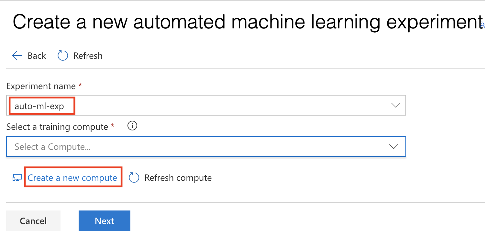

## Task 2: Create New Compute

1. Provide compute name: `auto-ml-compute`
2. Select your VM size: `Standard_DS3_v2`
3. Provide `Additional Settings`

   a. Minimum number of nodes: 1
   
   b. Maximum number of nodes: 1
   
4. Select **Create**
5. Wait for compute to be ready. This may take 2-3 minutes.
6. Select **Next**

   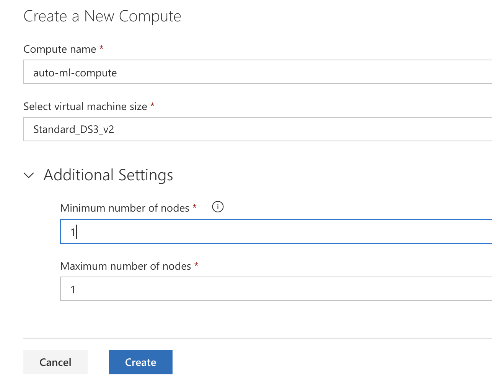

# Exercise 3: Upload and Review Training Data

## Task 1: Upload Training Data

- Select **Upload**
- Upload `nyc-taxi-sample-data.csv` from your local disk

  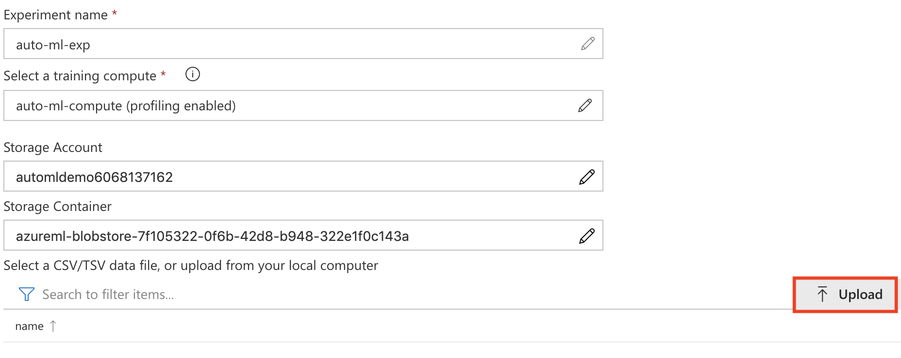

## Task 2: Review Training Data

- Select **nyc-taxi-sample-data.csv** from the list

  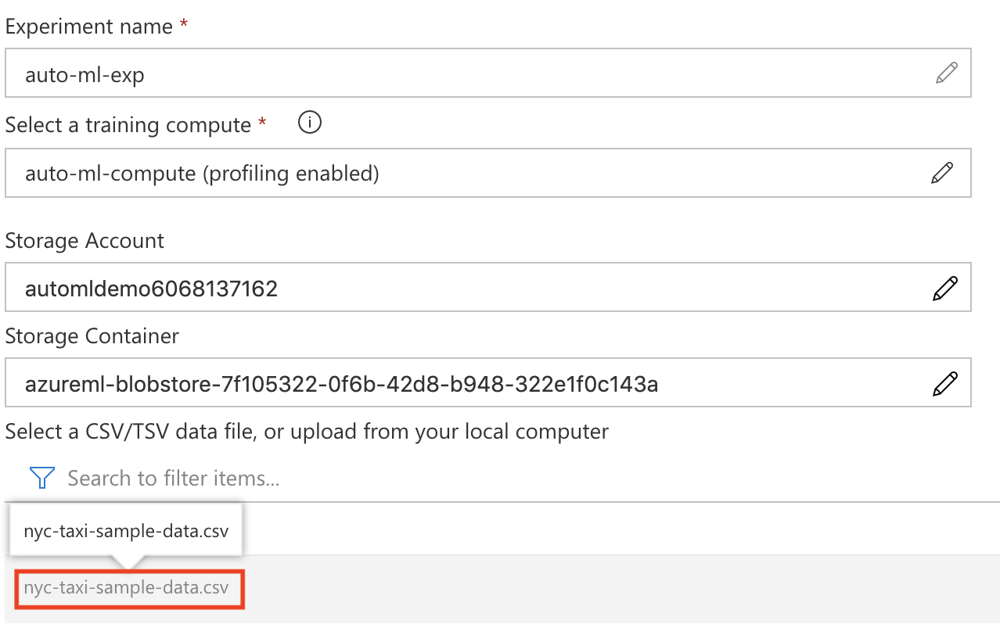

- Review your training data. Scroll to right to observe the target column: `totalAmount`

  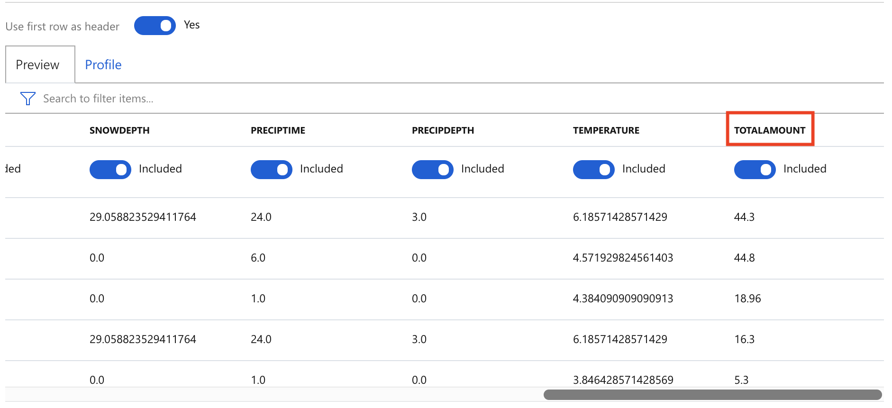

# Exercise 4: Setup Experiment Settings

## Task 1: Basic Settings

1. Select Prediction Task: **Regression**
2. Select Target column: **totalAmount**
3. Open **Advanced Settings**

   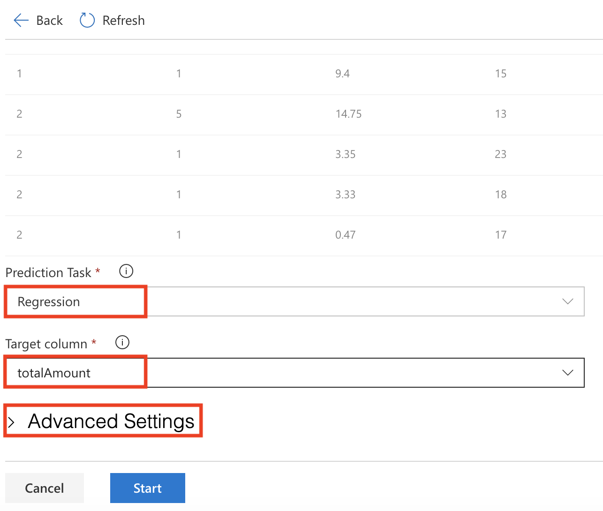

## Task 2: Advanced Settings

1. Select Primary metric **spearman_correlation**
2. Select Max number of iterations: **3**
3. Select Number of Cross Validations: **5**
4. Select Max concurrent iterations: **1**

   

# Exercise 5: Start and Monitor Experiment

## Task 1: Start Experiment

1. Scroll down and select **Start** to run the experiment

   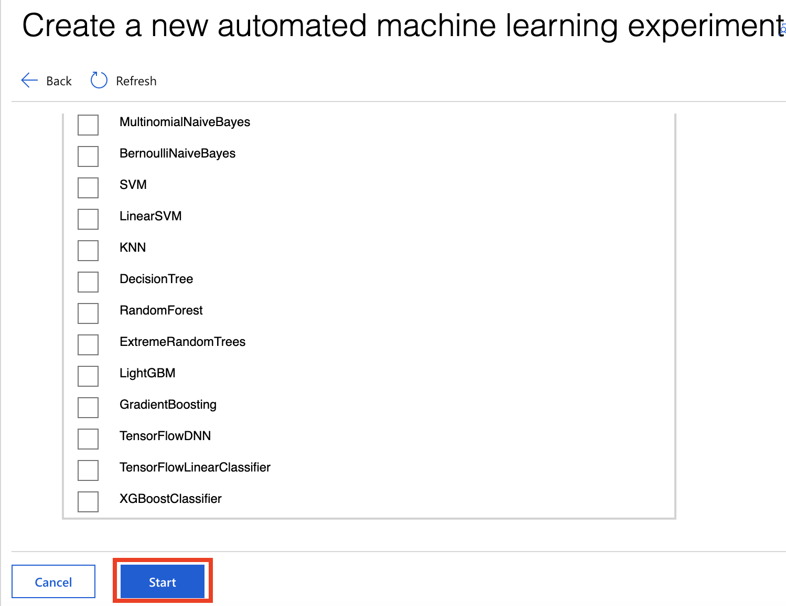

## Task 2: Monitor Experiment

1. The experiment will run for about *5-10 min*
2. In the **Run Details** screen, observe the performance of the various models for the primary metric: **spearman_correlation**

   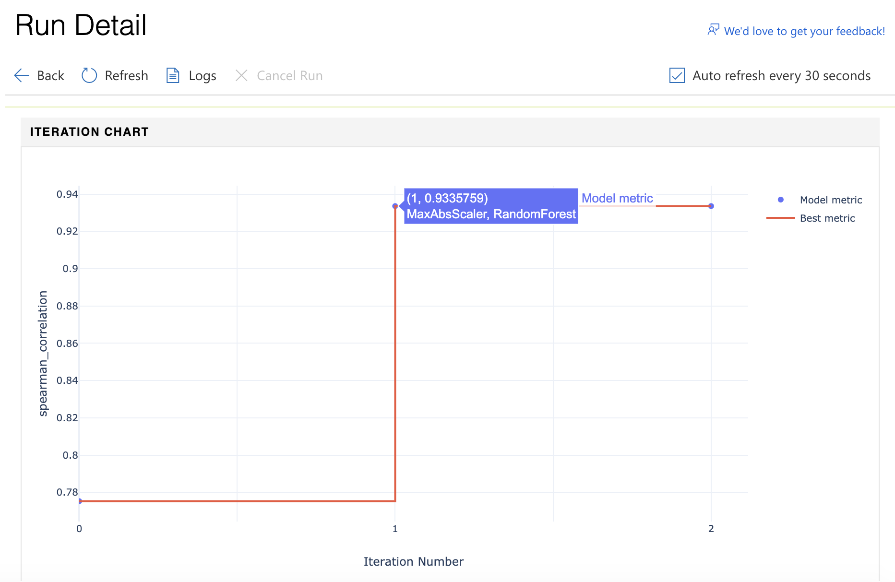
  
3. Scroll down to see a table view of different iterations
4. Wait for the experiment to complete

# Exercise 6: Review Best Model's Performance

## Task 1: Review Best Model Predictions

1. From the table view, select the iteration with the best **spearman_correlation** score. Note that the spearman_correlation measures the monotonic relationships between the predicted value and actual value. In this case, the model with spearman_correlation score closest to 1 is the best model.

   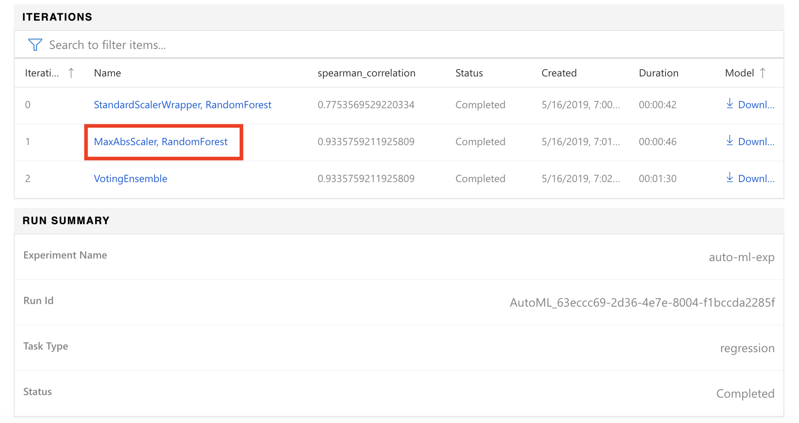
  
2. Review **Predicted Taxi Fare vs True Taxi Fare** for your model

   

## Task 2: Review Best Model Metrics

1. Scroll down to review various performance metrics for your model

   

# Exercise 7: Deploy Best Model

1. Return to `Run Details` screen
2. Select **Deploy Best Model** as shown

   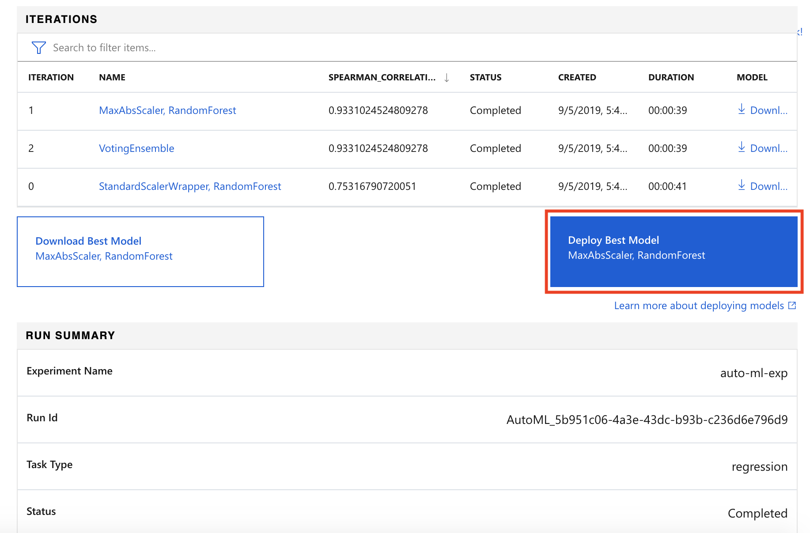

3. Provide the `Deployment name`, and `Deployment description`, and then select **Deploy** as shown:

   - Deployment name: `nyc-taxi-predict`
   - Deployment description: `Predict NYC Taxi Fares!`

   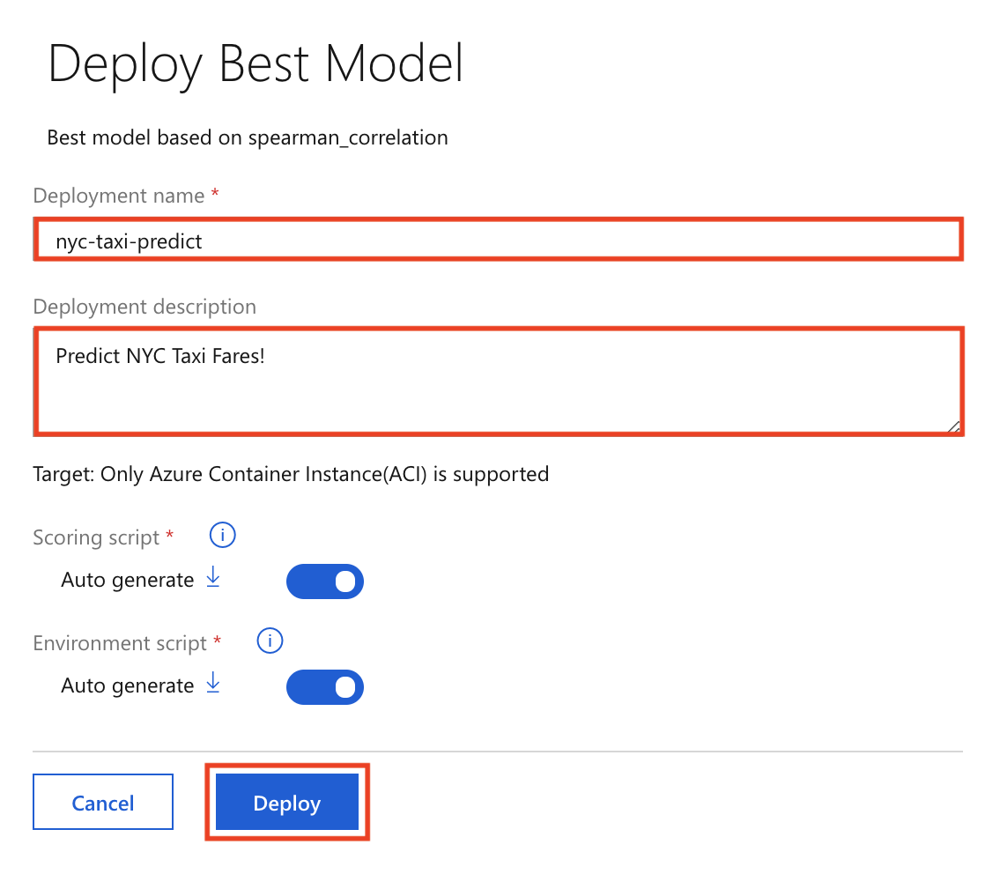

4. The model deployment, will register the model, create the deployment image, and deploy it as a scoring webservice in an Azure Container Instance (ACI). The entire deployment process can take up to 20 minutes. 

5. To view the deployed model, from the Azure Machine Learning workspace select **Deployments**.

   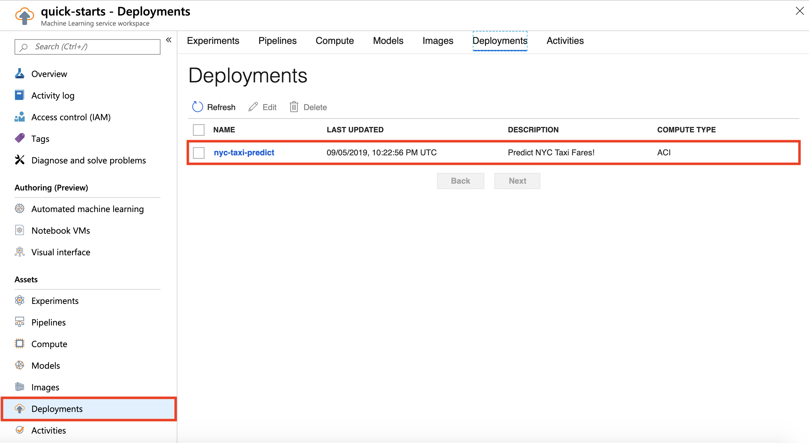

# Exercise 8: Challenge Experiment

In the current experiment, the pipeline of `MaxAbsScaler, RandomForest` gave us the best performing model with the spearman correlation score of: **0.934**. Can you expand the number of iterations for the Automated Machine Learning experiment to see if we can find a better performing model? Note that `Number of iterations` parameter is defined as follows: *In each iteration, a new machine learning model is trained with your data. This is the primary value that affects total run time.*

# Exercise 9: Clean-up

1. Navigate to the `Compute` section in your Azure Portal Workspace and delete your compute target: `auto-ml-compute`

   
