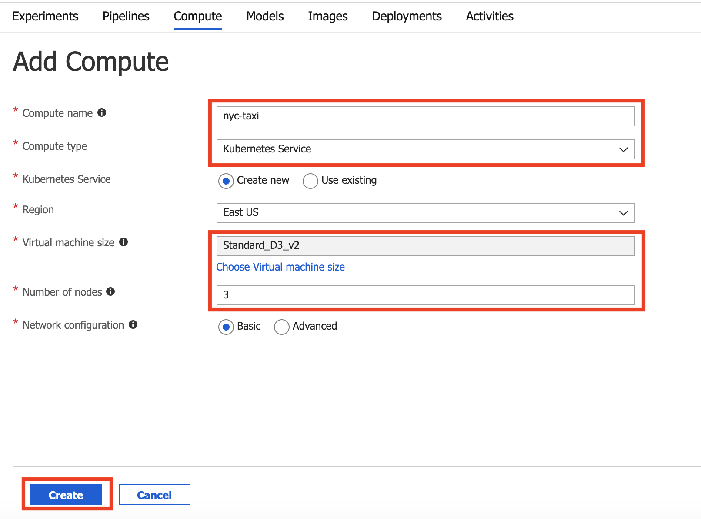

# Exercise 1: Setting up your environment 

If a lab environment has not be provided for you, this lab provides the instructions to get started in your own Azure Subscription.

The labs have the following requirements:
- Azure subscription. You will need a valid and active Azure account to complete this Azure lab. If you do not have one, you can sign up for a [free trial](https://azure.microsoft.com/en-us/free/).

## Azure Quotas Required
The quickstarts depend on the capability to utilize a certain quantity of Azure resources, for which your Azure subscription will need to have sufficient quota available. 

The following are the specific quotas required, if your subscription does not meet the quota requirements in the region in which you will perform the quickstarts, you will need to request a quota increase thru Azure support:

Compute-VM
- Quota: Standard Dv2 Family vCPUs
- Provider: Microsoft.Compute
- SKU family: Dv2 Series
- Required Limit: 14

Compute-VM
- Quota: Total Regional vCPUs
- Provider: Microsoft.Compute
- SKU family: Dv2 Series
- Required Limit: 14

## Prerequisites

- Create an Azure resource group named: `QuickStarts`. See [Create Resource Groups](https://docs.microsoft.com/en-us/azure/azure-resource-manager/manage-resource-groups-portal) for details on how to create the resource group.

- Create an Azure Machine Learning service workspace named: `quick-starts-ws`. See [Create an Azure Machine Learning Service Workspace](https://docs.microsoft.com/en-us/azure/machine-learning/service/setup-create-workspace) for details on how to create the workspace.

Next, we will upfront create two Azure Machine Learning Computes, one for running machine learning experiments and the other for deploying trained models. Creating computes can take upto 5 minutes, thus we can start the creation and move on to the quickstart to conserve time. 

## Task 1: Create Azure Machine Learning Compute

Create a compute target in the workspace `quick-starts-ws` to run your Azure Machine Learning experiments.

1. Navigate to your workspace `quick-starts-ws` and select `Compute` from the `Assets` section and then select on **Add Compute**:

   

2. On the **Add Compute**, enter the following and then select **Create**:

   a. Compute name: `qs-compute`
   
   b. Compute type: `Machine Learning Compute`
   
   c. Region: `Select your region`
   
   d. Virtual machine size: `Standard_D2_v2`
   
   e. Minimum number of nodes: `1`
   
   f. Maximum number of nodes: `1`
   
   

## Task 2: Create Kubernetes Service Compute

Next, we will create a Kubernetes Service Compute to publish the trained model as web service.

1. Navigate to your workspace `quick-starts-ws` and select `Compute` from the `Assets` section and then select on **Add Compute**

2. On the **Add Compute**, enter the following and then select **Create**:

   a. Compute name: `nyc-taxi`
   
   b. Compute type: `Kubernetes Service`
   
   c. Region: `Select your region`
   
   d. Virtual machine size: `Standard_D3_v2`
   
   e. Number of nodes: `3`
   
   
   
## Task 3: Download the training data file

1. Download the training data file [nyc-taxi-sample-data.csv](https://quickstartsws9073123377.blob.core.windows.net/azureml-blobstore-0d1c4218-a5f9-418b-bf55-902b65277b85/quickstarts/nyc-taxi-data/nyc-taxi-sample-data.csv) on your local disk.
