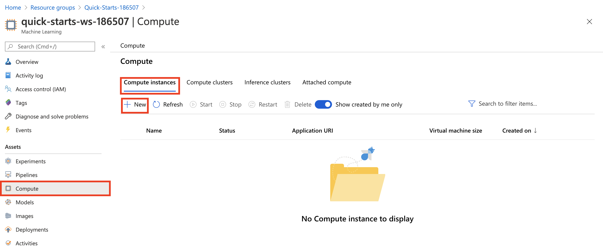
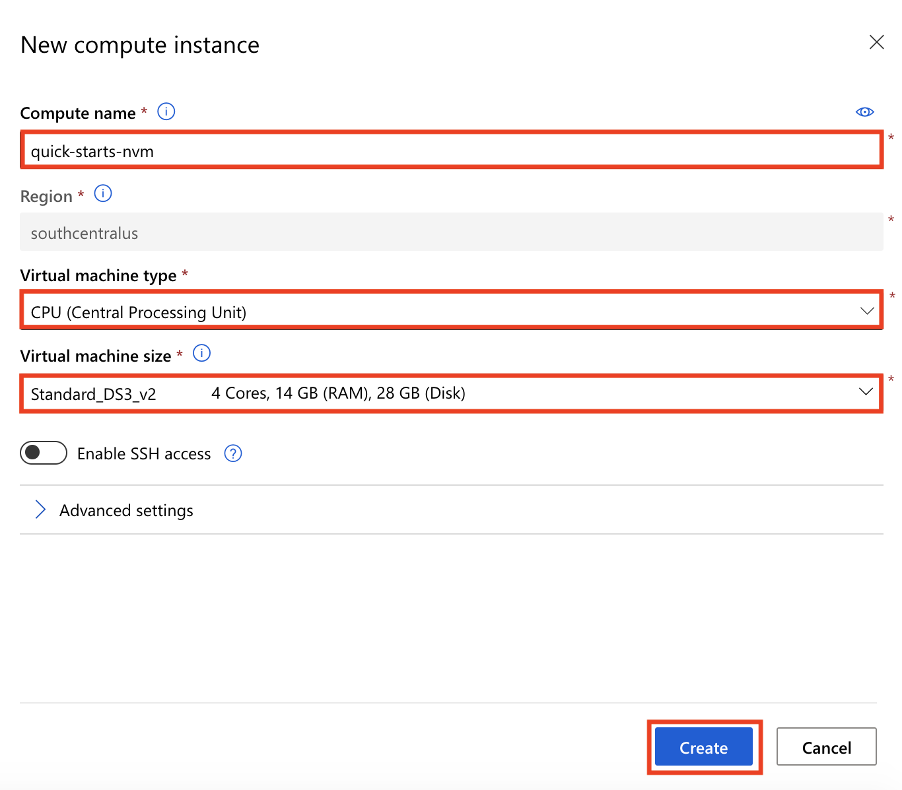
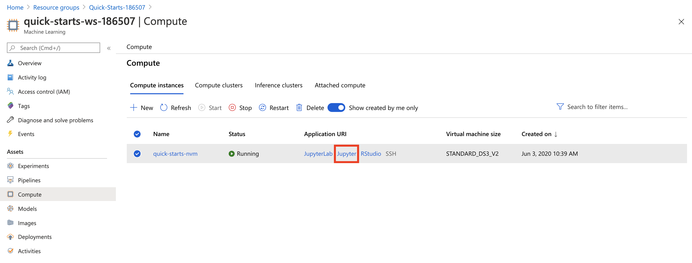
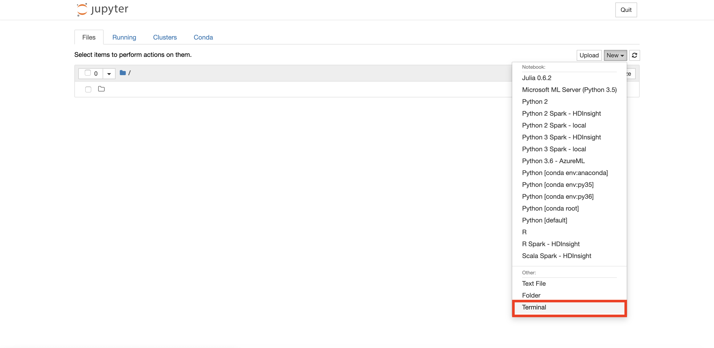
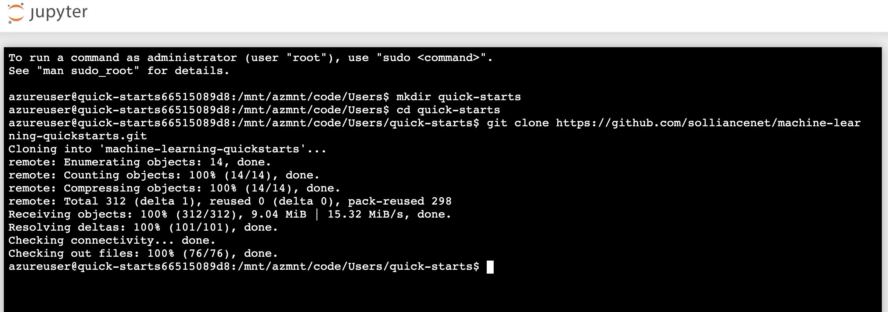

# Technology overview

## Automated Machine Learning with Azure Machine Learning
Automated machine learning picks an algorithm and hyperparameters for you and generates a model ready for deployment. There are several options that you can use to configure automated machine learning experiments.

Configuration options available in automated machine learning:

- Select your experiment type: Classification, Regression or Time Series Forecasting
- Data source, formats, and fetch data
- Choose your compute target: local or remote
- Automated machine learning experiment settings
- Run an automated machine learning experiment
- Explore model metrics
- Register and deploy model

You can create and run automated machine learning experiments in code using the [Azure ML Python SDK](https://docs.microsoft.com/en-us/azure/machine-learning/service/how-to-configure-auto-train) or if you prefer a no code experience, you can also Create your automated machine learning experiments in the [Azure portal](https://docs.microsoft.com/en-us/azure/machine-learning/service/how-to-create-portal-experiments).

# Quickstart Overview

In this quickstart, you will use compute resources provided by Azure Machine Learning service to remotely train a set of models using Automated Machine Learning using [Azure ML Python SDK](https://docs.microsoft.com/en-us/azure/machine-learning/service/how-to-configure-auto-train). Next, you will evaluate performance of each model and pick the best performing model to deploy as a scoring web service hosted by Azure Container Instance. Finally, you will test the scoring web service: (1) by make direct calls on service object, (2) by calling the service end point (Scoring URI) over http.

As part of this quickstart, we will be building a regression model to predict Taxi Fares in New York City. We will use a preprocessed labeled training data with features such as number of passengers, trip distance, datetime, holiday information and weather information.

# Exercise 1: Setting up your environment 

If a lab environment has not be provided for you, this lab provides the instructions to get started in your own Azure Subscription.

The labs have the following requirements:
- Azure subscription. You will need a valid and active Azure account to complete this Azure lab. If you do not have one, you can sign up for a [free trial](https://azure.microsoft.com/en-us/free/).

## Azure Quotas Required
The quickstarts depend on the capability to utilize a certain quantity of Azure resources, for which your Azure subscription will need to have sufficient quota available. 

The following are the specific quotas required, if your subscription does not meet the quota requirements in the region in which you will perform the quickstarts, you will need to request a quota increase thru Azure support:

Compute-VM
- Quota: Standard Dv2 Family vCPUs
- Provider: Microsoft.Compute
- SKU family: Dv2 Series
- Required Limit: 6

Compute-VM
- Quota: Total Regional vCPUs
- Provider: Microsoft.Compute
- SKU family: Dv2 Series
- Required Limit: 6

# Prerequisites

- If an environment is provided to you. Use the workspace named: `quick-starts-ws-XXXXX`, where `XXXXX` is your unique identifier.

- If you are using your own Azure subscription. Create an Azure Machine Learning service workspace named: `quick-starts-ws`. See [Create an Azure Machine Learning Service Workspace](https://docs.microsoft.com/en-us/azure/machine-learning/service/setup-create-workspace) for details on how to create the workspace.

# Exercise 2: Azure Notebook VMs Setup

At a high level, here are the setup tasks you will need to perform to prepare your Azure Notebook VM Environment (the detailed instructions follow):

1. Create a Notebook VM in your Azure subscription

2. Import the Quickstart Notebooks

3. Update your Notebook Environment 

## Task 1: Create a Notebook VM

1. Log into [Azure Portal](https://portal.azure.com/) and open the machine learning workspace: quick-starts-ws-XXXXX or quick-starts-ws

2. Select **Notebook VMs** in the left navigation and then select **New**

   

3. Provide Name: `quick-starts-vm` and Virtual machine size: `STANDARD_D3_V2` and then select **Create**

   
  
4. Wait for the VM to be ready, it will take around 5-10 minutes.

## Task 2: Import the Quickstart Notebooks

1. Select the Notebook VM: **quick-starts-vm** and then select **Jupyter** open icon, to open Jupyter Notebooks interface.

   

2. Select **New, Terminal** as shown to open the terminal page.

   
  
3. Run the following commands in order in the terminal window:

   a. `mkdir quick-starts`
   
   b. `cd quick-starts`
   
   c. `git clone https://github.com/solliancenet/machine-learning-quickstarts.git`
   
      
   
   d. Wait for the import to complete.

## Task 3: Update your Notebook Environment 

1. From the Jupyter Notebooks interface, navigate to the `quick-starts->machine-learning-quickstarts->quickstart-2.0->notebooks` folder where you will find all your quickstart files.

2. Open notebook: **aml-setup.ipynb**

3. Run each cell in the notebook to install the required libraries.

# Exercise 3: Complete the Quickstart

1. From the Jupyter Notebooks interface, navigate to the `quick-starts->machine-learning-quickstarts->quickstart-2.0->notebooks` folder where you will find all your quickstart files.

2. Open notebook: **automl-with-AML.ipynb**

3. Follow the instructions within the notebook to complete the quickstart.
