# Exercise 1: Setting up your environment 

If a lab environment has not be provided for you, this lab provides the instructions to get started in your own Azure Subscription.

The labs have the following requirements:
- Azure subscription. You will need a valid and active Azure account to complete this Azure lab. If you do not have one, you can sign up for a [free trial](https://azure.microsoft.com/en-us/free/).

## Azure Quotas Required
The quickstarts depend on the capability to utilize a certain quantity of Azure resources, for which your Azure subscription will need to have sufficient quota available. 

The following are the specific quotas required, if your subscription does not meet the quota requirements in the region in which you will perform the quickstarts, you will need to request a quota increase thru Azure support:

Compute-VM
- Quota: Standard Dv2 Family vCPUs
- Provider: Microsoft.Compute
- SKU family: Dv2 Series
- Required Limit: 14

Compute-VM
- Quota: Total Regional vCPUs
- Provider: Microsoft.Compute
- SKU family: Dv2 Series
- Required Limit: 14

## Prerequisites

- Create an Azure resource group named: `QuickStarts`. See [Create Resource Groups](https://docs.microsoft.com/en-us/azure/azure-resource-manager/manage-resource-groups-portal) for details on how to create the resource group.

- Create an Azure Machine Learning service workspace named: `quick-starts-ws`. See [Create an Azure Machine Learning Service Workspace](https://docs.microsoft.com/en-us/azure/machine-learning/service/setup-create-workspace) for details on how to create the workspace.

Next, we will upfront create two Azure Machine Learning Computes, one for running machine learning experiments and the other for deploying trained models. Creating computes can take upto 5 minutes, thus we can start the creation and move on to the quickstart to conserve time. 

## Task 1: Create Azure Machine Learning Compute

Create a compute target in the workspace `quick-starts-ws` to run your Azure Machine Learning experiments.

1. Navigate to your workspace `quick-starts-ws` and select `Compute` from the `Assets` section and then select on **Add Compute**:

   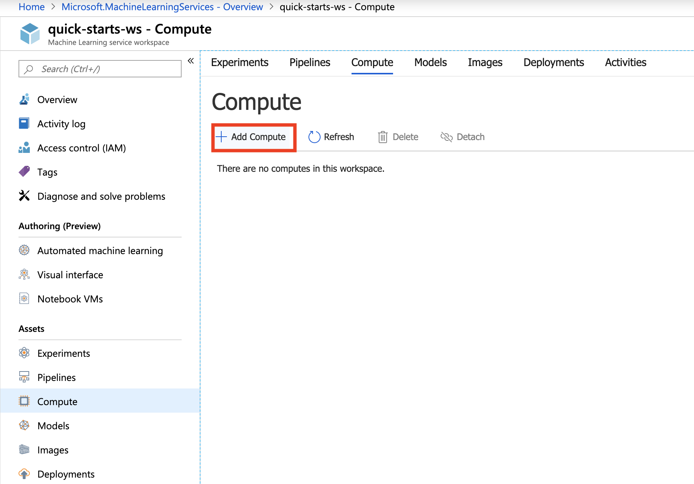

2. On the **Add Compute**, enter the following and then select **Create**:

   a. Compute name: `qs-compute`
   
   b. Compute type: `Machine Learning Compute`
   
   c. Region: `Select your region`
   
   d. Virtual machine size: `Standard_D2_v2`
   
   e. Minimum number of nodes: `1`
   
   f. Maximum number of nodes: `1`
   
   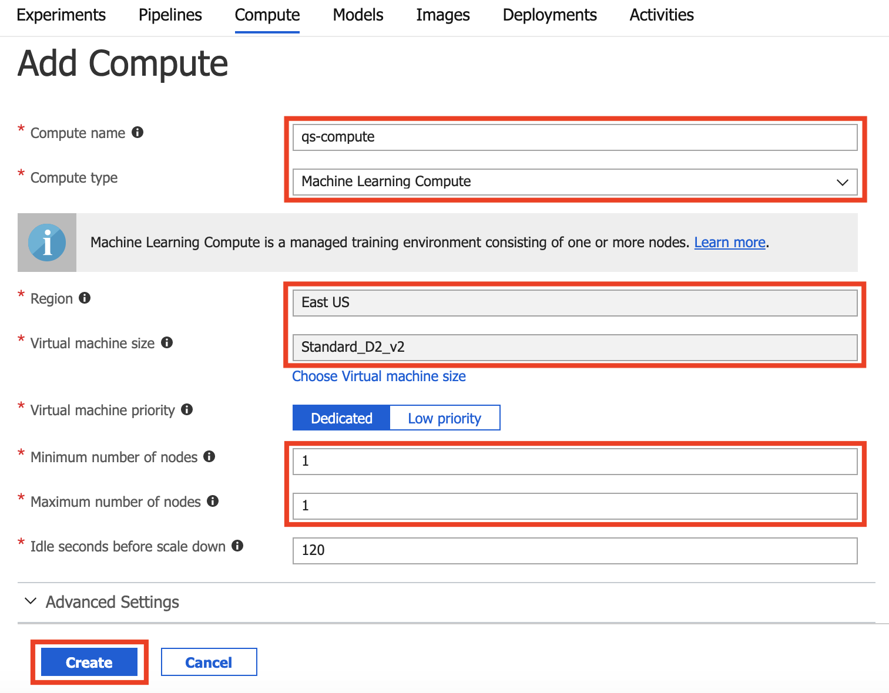

## Task 2: Create Kubernetes Service Compute

Next, we will create a Kubernetes Service Compute to publish the trained model as web service.

1. Navigate to your workspace `quick-starts-ws` and select `Compute` from the `Assets` section and then select on **Add Compute**

2. On the **Add Compute**, enter the following and then select **Create**:

   a. Compute name: `nyc-taxi`
   
   b. Compute type: `Kubernetes Service`
   
   c. Region: `Select your region`
   
   d. Virtual machine size: `Standard_D3_v2`
   
   e. Number of nodes: `3`
   
   
   
## Task 3: Download the training data file

1. Download the training data file [nyc-taxi-sample-data.csv](https://quickstartsws9073123377.blob.core.windows.net/azureml-blobstore-0d1c4218-a5f9-418b-bf55-902b65277b85/quickstarts/nyc-taxi-data/nyc-taxi-sample-data.csv) on your local disk.

# Exercise 2: Upload Training Dataset in Visual Interface

## Task 1: Open Visual Interface

1. Navigate to the machine learning workspace: `quick-starts-ws`
2. Select `Visual interface` in the left navigation bar
3. Select on **Launch visual interface**

   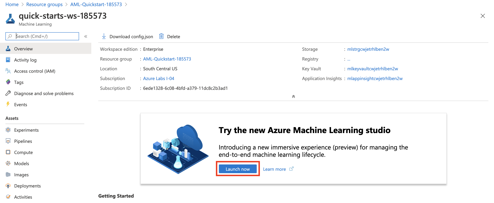

## Task 2: Upload Training Dataset

1. From within Visual Interface select **+ New**

   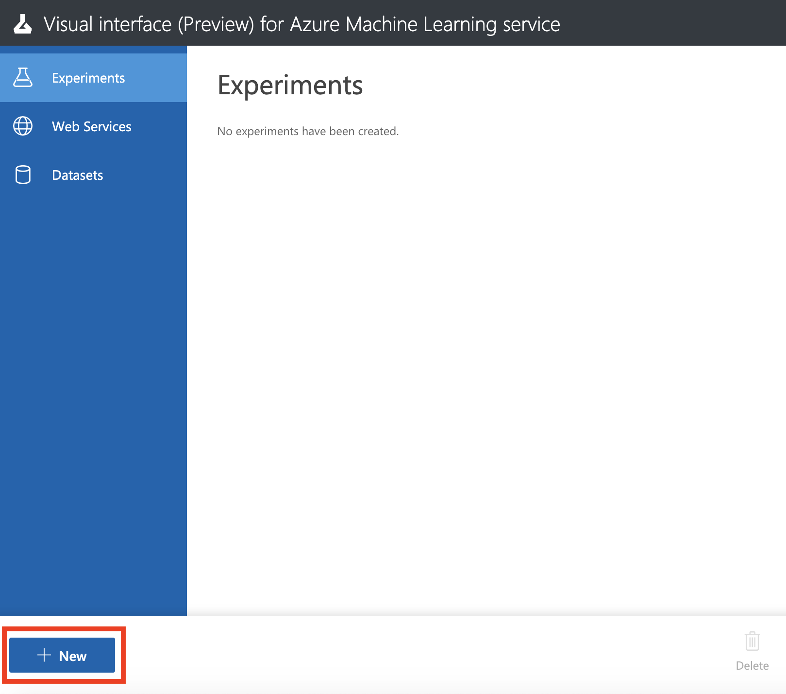

2. From the left navigation select **Datasets**
3. From **New Datasets** select **Upload from Local File**

   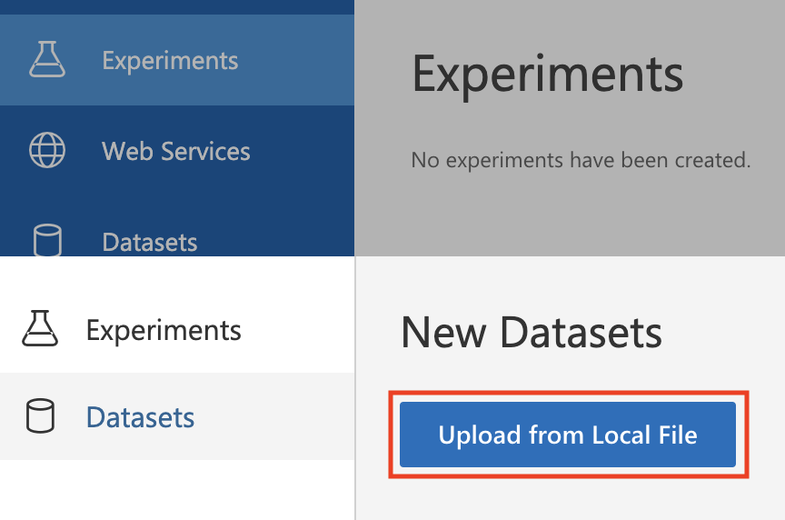

4. Use **Choose File** to select `nyc-taxi-sample-data.csv` from your local disk and then select **Ok**

   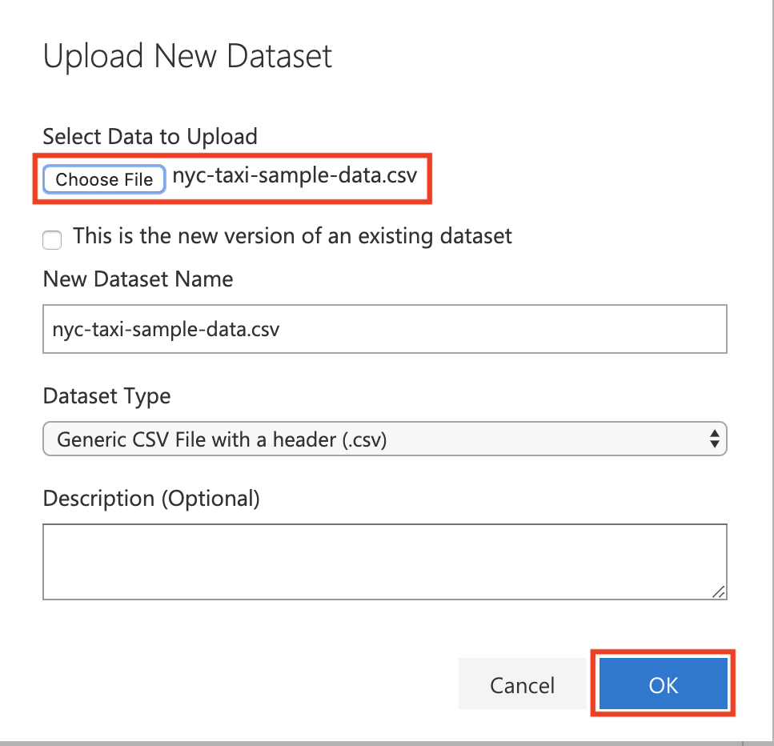

# Exercise 3: Define Experiment

## Task 1: Create New Blank Experiment

1. From within Visual Interface select **+ New**
2. Select **+ Blank Experiment**

   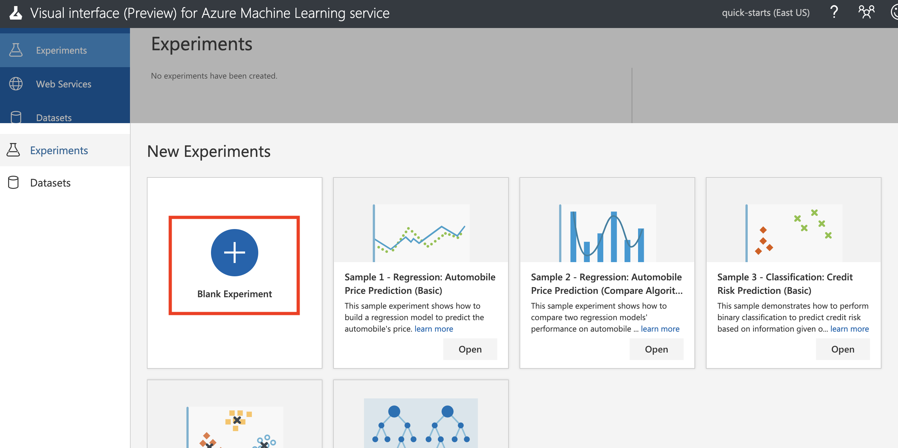

## Task 2: Select Dataset

1. Expand **Saved Datasets, My Datasets** in the left navigation

   

2. Drag and drop the dataset `nyc-taxi-sample-data.csv` on to the canvas

   

## Task 3: Select Columns in Dataset

1. Open **Data Transformation, Manipulation section** section in the left panel
2. Drag and drop **Select Columns in Dataset** module on to the canvas
3. Select the added `Select Columns in Dataset` module
4. Click on **Edit columns** in the right panel

   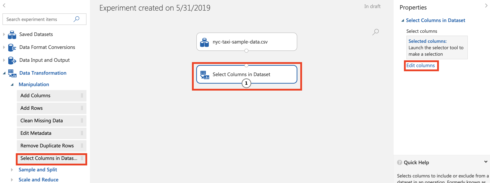

5. Select **Begin With All Columns** and then in the drop down select **Exclude**. Enter the column name `vendorID` in the textbox and then select **Ok**.

   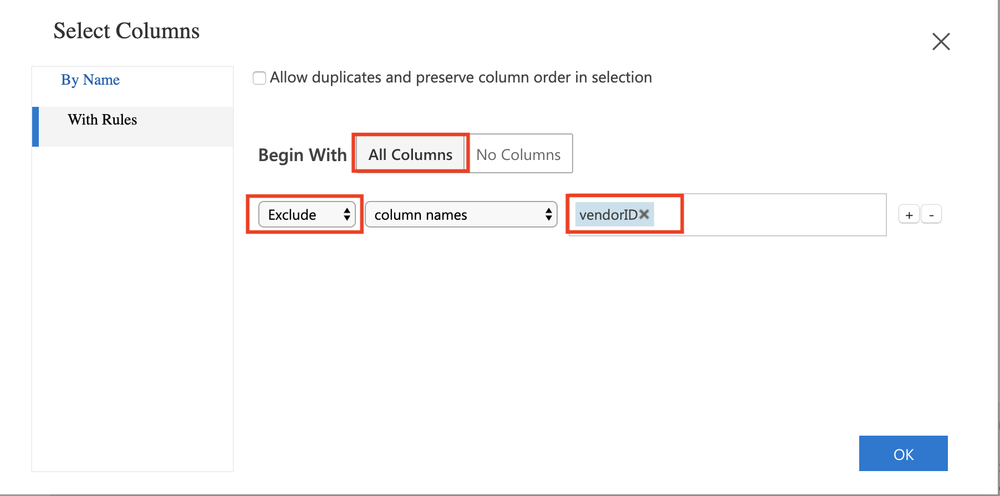
   
## Task 4: Clean Missing Data
   
1. Add **Clean Missing Data** module
2. Connect the `Dataset` to `Select Columns in Dataset` module
3. Connect the `Select Columns in Dataset` to `Clean Missing Data` module
4. Select the added  `Clean Missing Data` module
5. Select `Replace with mean` as `Cleaning mode` in the right panel
6. Select on **Edit columns** in the right panel

   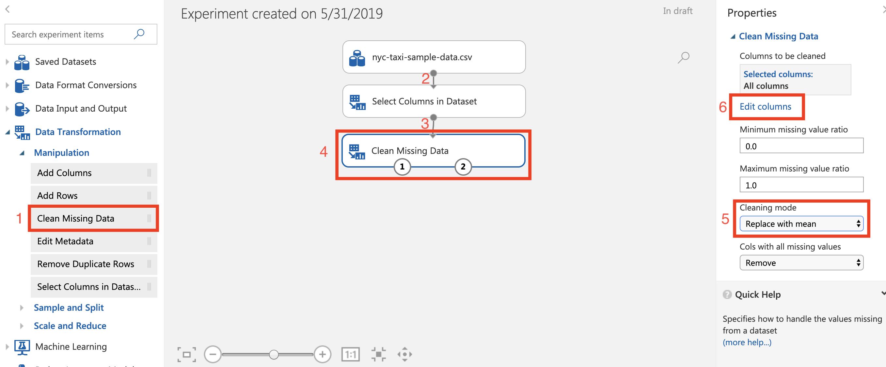

7. Exclude the two non-numeric data columns `normalizeHolidayName` and `isPaidTimeOff` and then select **Ok**

   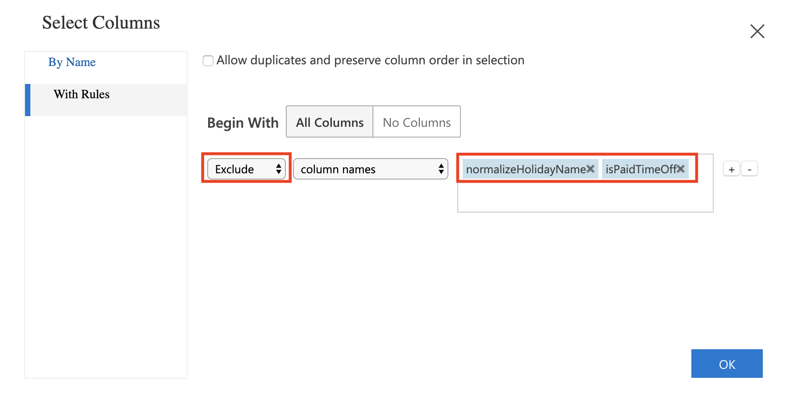

## Task 5: Split the Training Data

1. Expand **Data Transformation, Sample and Split** in the left navigation and add the **Split Data** module 
2. Connect the first output from `Clean Missing Data` module to the `Split Data` module
3. Select the **Split Data** module
4. Set `0.7` as the fraction of rows in first output

   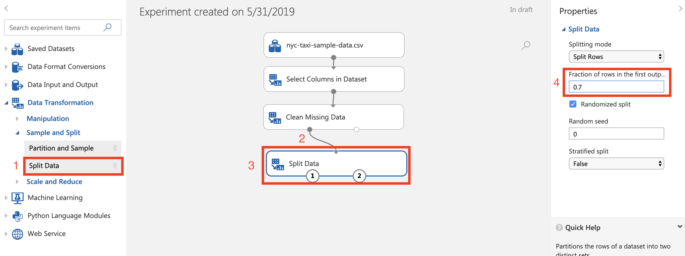

*Note that you can run the experiment at any point to peek at the outputs and activities. Running experiments also generates metadata that is available for downstream activities such selecting column names from a list in selection dialogs.*

## Task 6: Initialize Regression Model

1. Expand **Machine Learning, Initialize Model, Regression** section in the left panel
2. Add the **Boosted Decision Tree Regression** module on to the canvas
3. Configure your model parameters: `Minimum number of samples per node: 1` and `Learning rate: 0.1`

   

## Task 7: Setup Train Model Module

1. Expand **Machine Learning, Train** section in the left panel
2. Add **Train Model** module on to the canvas

   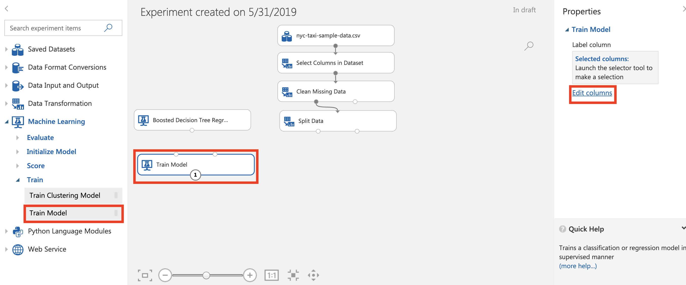
   
3. Select on **Edit columns** in the right panel to setup your `Label or Target column`
4. Select `totalAmount` as your target column, and then select **Ok**

   
   
## Task 8: Make Connections to Train Module

1. Connect the `Boosted Decision Tree Regression` module to `Train Model` module
2. Connect the first output of `Split Data` module to `Train Model` module

   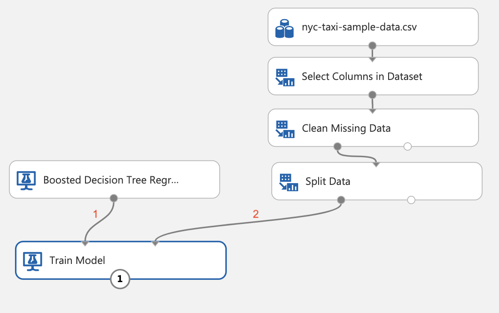

## Task 9: Setup Score Model Module

1. Expand **Machine Learning, Score** section in the left panel
2. Add **Score Model** module on to the canvas
3. Connect the `Train Model` module to the first input of the `Score Model` module
4. Connect the second output of `Split Data` module to the second input of the `Score Model` module

   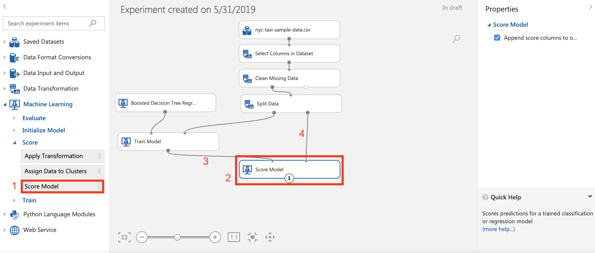

*Note that `Split Data` module will feed data for both model training and model scoring. The first output (0.7 fraction) will connect with the `Train Model` module and the second output (0.3 fraction) will connect with the `Score Model` module.*
   
## Task 10: Setup Evaluate Model Module

1. Open **Machine Learning, Evaluate** section in the left panel
2. Add **Evaluate Model** module on to the canvas
3. Connect the `Score Model` module to `Evaluate Model` module

   

# Exercise 4: Run Experiment

## Task 1: Select Run Experiment

1. From the experiment select **Run**

   
   
## Task 2: Select Compute to Run Experiment
   
1. Note that you can create a new **Compute Target** directly from **Visual Interface**
2. Select **Select existing**
3. Select **qs-compute** (this is the compute target we created in `quickstart-2.0`)
4. Select **Run**
5. The experiment will run for about 8-10 minutes 

   

# Exercise 5: Visualize Results

## Task 1: Visualize the Model Predictions

1. Wait for model training to be complete
2. Right click on **Score Model** module and select **Scored dataset -> Visualize**

   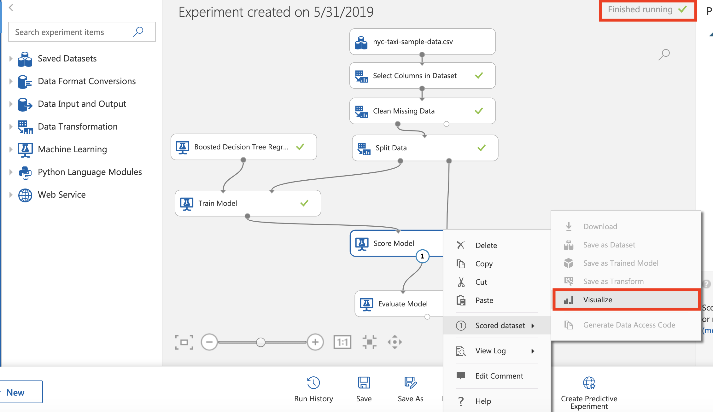
   
3. Compare the predicted `predicted taxi fares` to the `target taxi fares`
4. You can also observe the predicted value distribution when you select the `Scored Labels` column 

   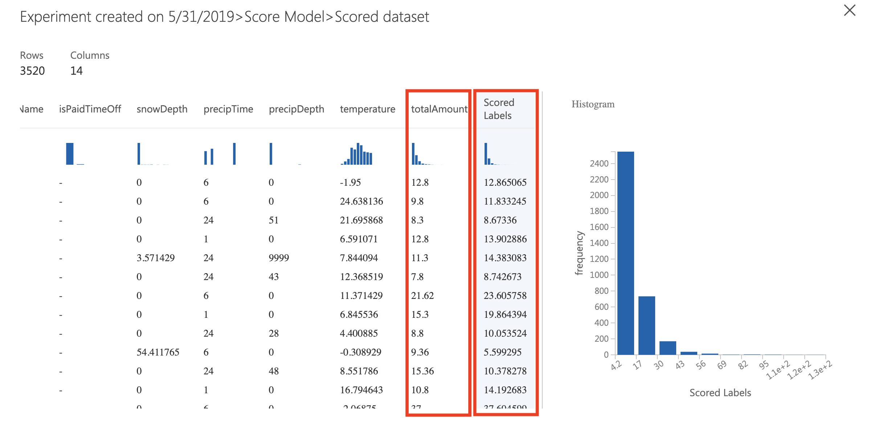

## Task 2: Visualize the Evaluation Results

1. Right click on **Evaluate Model** module and select **Evaluation results -> Visualize**

   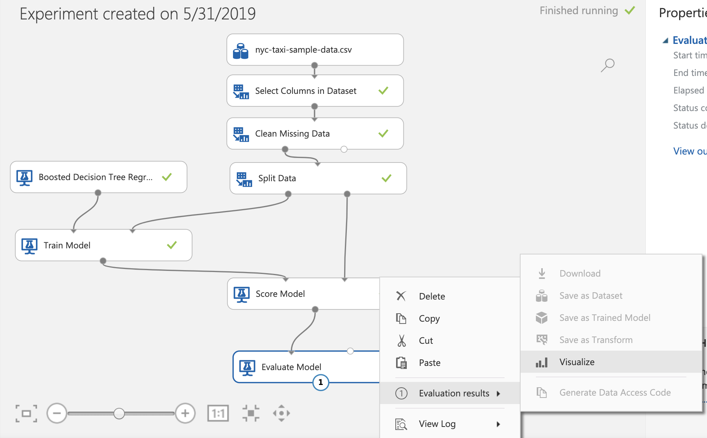
   
2. Observe the Model Evaluation Metrics such as **Root Mean Squared Error**

   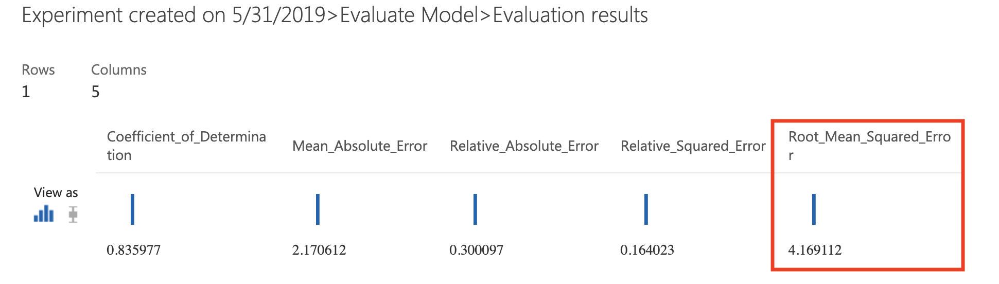

# Exercise 6: View Experiment Run History

## Task 1: Go to Run History

1. From the experiment select **Run History**

   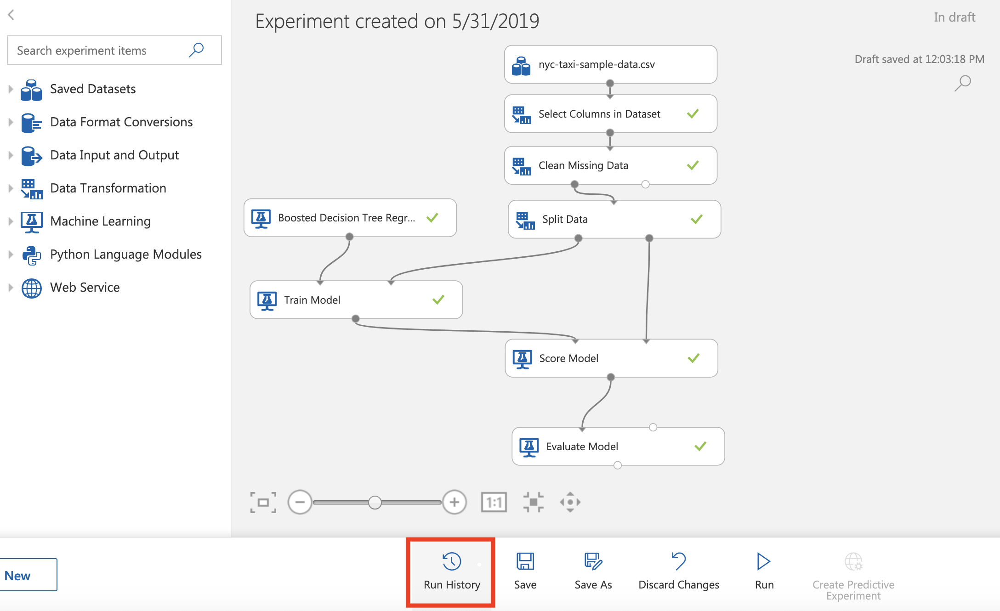
   
## Task 2: Return to Experiment
   
1. Go back to the Experiment by selecting the Run History item with `Editable` state

   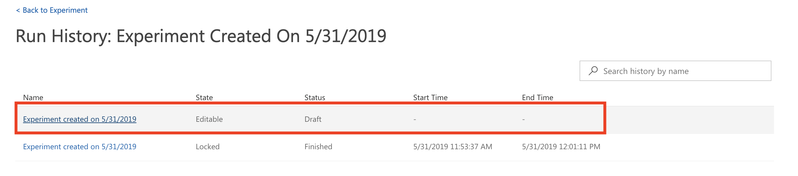

# Exercise 7: Save Trained Model

## Task 1: Save Trained Model

1. Right click on the `Train Model` module and select **Trained model -> Save as Trained Model**

   
   
2. Provide `model name` and select **Ok**

   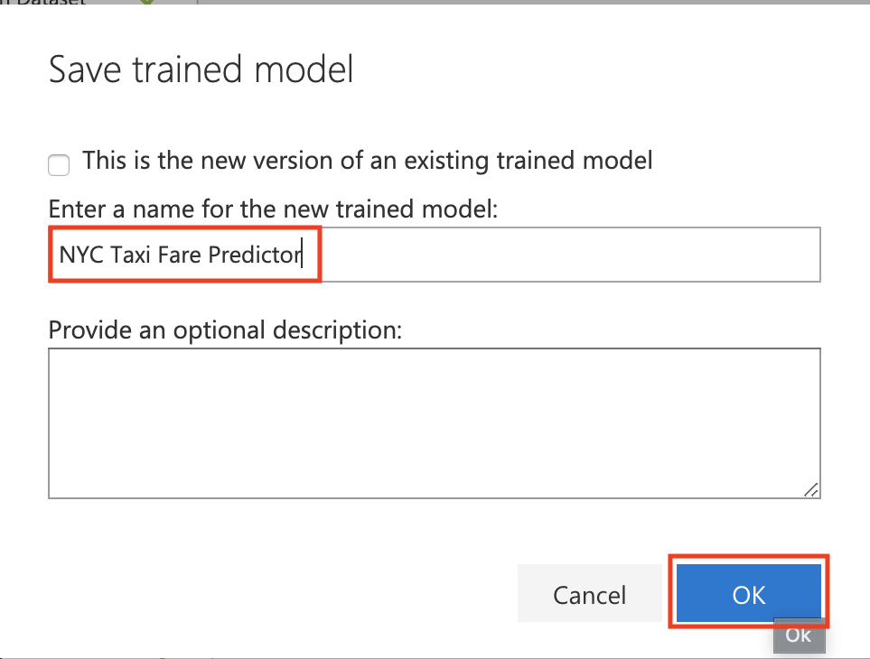

# Exercise 8: Run Predictive Experiment

## Task 1: Create Predictive Experiment

1. Observe the saved model appears in the `Trained Models` section
2. Select **Create Predictive Experiment**
3. This will create the `Predictive Experiment` in a new tab named: **Predictive experiment**

   

## Task 2: Run Predictive Experiment

1. From the **Predictive experiment** tab, select **Run**
2. Select the existing compute target to run the predictive experiment
3. It will take about 4-5 minutes to run the predictive experiment

   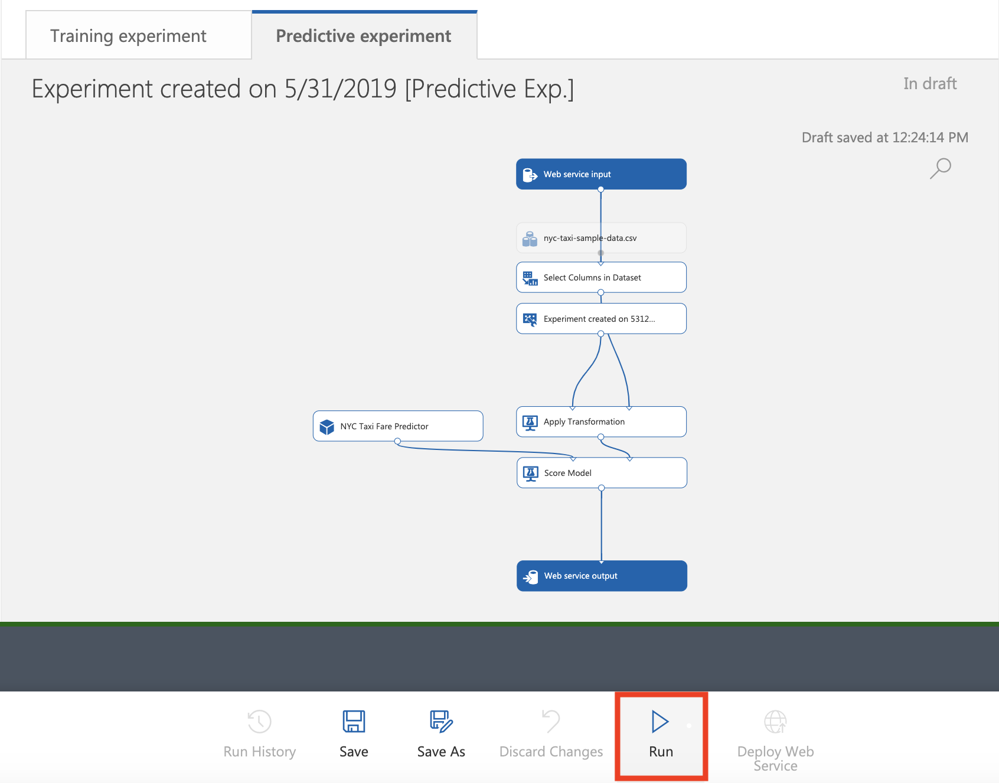

# Exercise 9: Deploy Web Service on Kubernetes Service Compute

## Task 1: Deploy Web Service

1. From the **Predictive experiment** tab, select **Deploy Web Service**

   
   
## Task 2: Select Compute Target to Deploy Web Service
   
1. Select the existing Kubernetes Service compute, and select **Deploy**

   

# Exercise 10: Consume the Deployed Web Service

## Task 1: Open the Deployed Web Service

1. Navigate to the Web Services section of the Visual Interface

2. Select the deployed Web Service

   
   
## Task 2: Test the Web Service

1. Fill in the input data for predicting the NYC Taxi Fare, and select **Test**

## Task 3: Observe Predictions

1. Select the **Raw** test results and observe the predicted NYC Taxi Fare: **Scored Labels**

   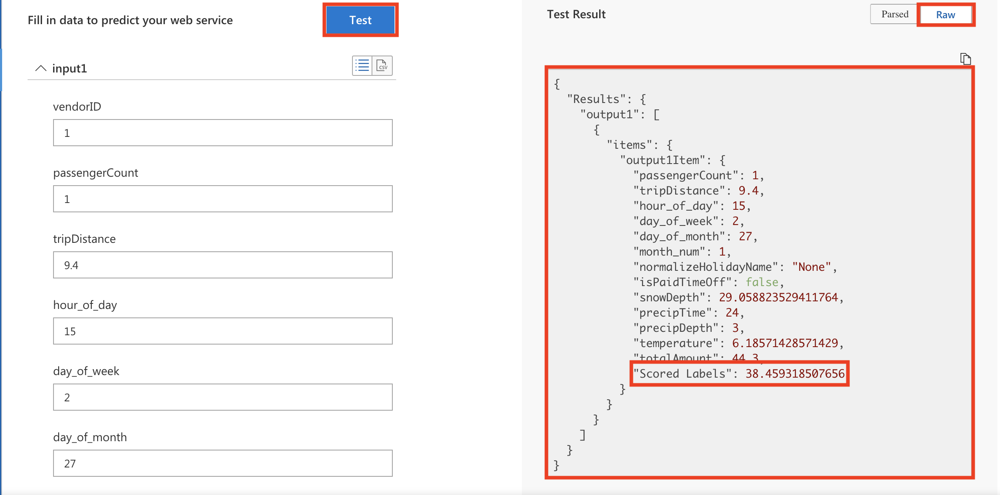

## Task 4: Review how to Consume the Deployed Web Service

1. Navigate to the **Consume** section of the Web Service
2. Observe the provided sample code in C#, Python, and R to consume the Web Service

   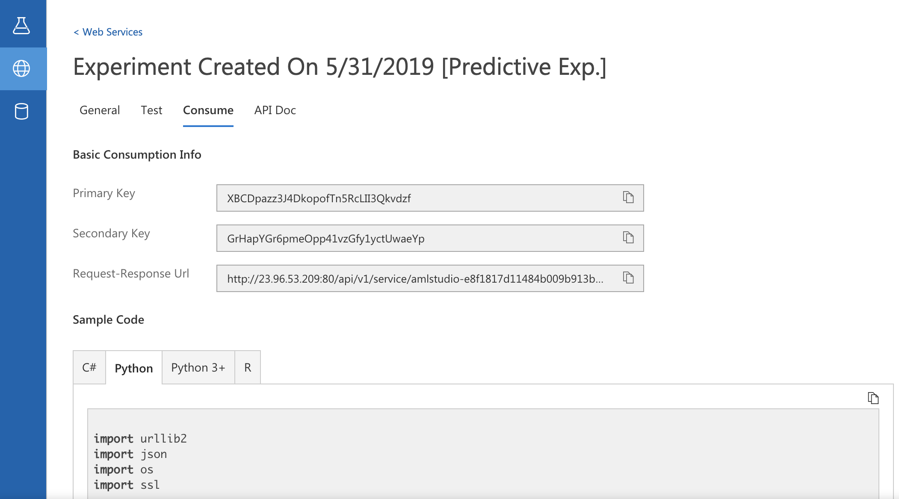

# Exercise 11: Challenge Experiment

Is there another regression model that can give us an improved evaluation score on the `Root Mean Square Error (RMSE)` metric?  The `Boosted Decision Tree Regression` gave us an RMSE score of **4.17**. Experiment with other models like the `Neural Net Regression` model and evaluate if you can train a better performing model on the RMSE metric. Please note that the objective is to minimize the RMSE score.

# Exercise 12: Cleanup Resources

## Task 1: Delete Web Service

1. Go to Azure Portal and navigate to the Deployments section of the workspace
2. **Delete** the deployed Web Service

   

## Task 2: Delete Compute Targets

1. Navigate to **Compute** section
2. **Delete** both the compute targets created for this quickstart - one at a time

   

